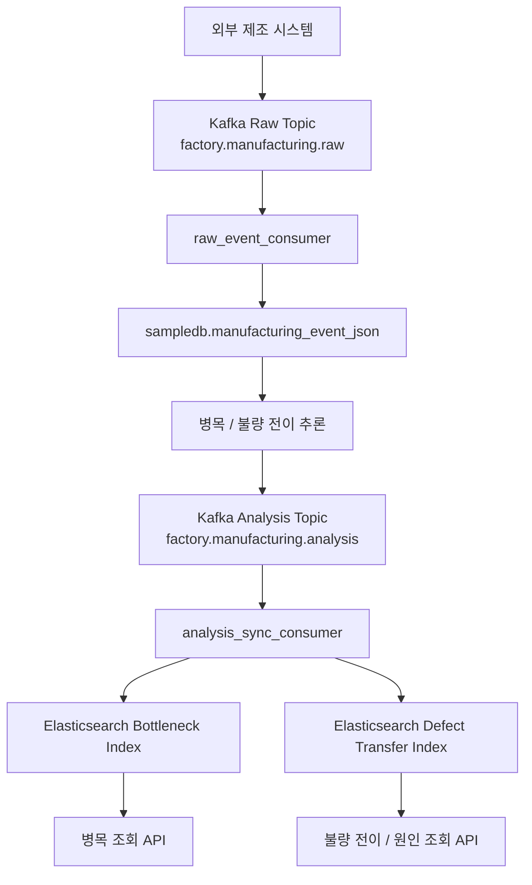
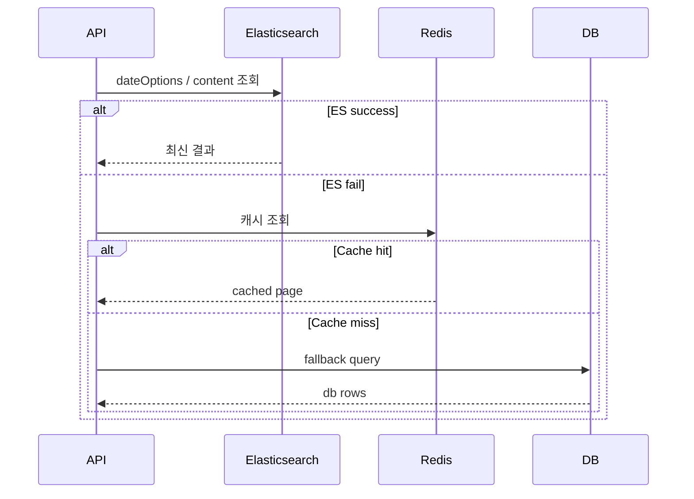

# AIMS - AI Service

### AIMS (Auto Intelligence Manufacturing System) - AI 기반 자동차 스마트팩토리 관제 시스템

`ai-service`는 SK 쉴더스 루키즈 개발 5기 **AI 기반 자동차 스마트팩토리 관제 시스템 AIMS**에서 발생하는 제조 이벤트를 기반으로 병목 분석, 불량 전이 예측, SHAP 기반 원인 분석, AI 메뉴얼 생성을 제공하는 FastAPI 기반 AI 서비스입니다.

제조 이벤트를 수집하고 분석 결과를 DB와 Elasticsearch에 함께 반영한 뒤, 운영 화면이 빠르게 최신 상태를 볼 수 있도록 돕는 역할을 합니다.

핵심적으로는 다음을 수행합니다.

- 공정별 병목을 계산합니다.
- 어떤 차량이 다음 공정에서 불량으로 이어질 가능성이 있는지 예측합니다.
- SHAP으로 불량 전이 원인을 설명합니다.
- 운영자가 바로 읽을 수 있는 AI 메뉴얼을 생성합니다.
- Kafka로 입력과 분석을 분리하고, Elasticsearch로 조회 성능을 확보합니다.

&nbsp;
## ✨ 주요 기능

### 1. 불량 탐지 및 전이 예측


- 차량 단위로 다음 공정 불량 가능성을 예측하고 전이 경로를 함께 봅니다.
- 현재 공정, 다음 공정, 설비 신호, 사이클 타임, 대기 시간, 재공 수량, 진동/온도/도막 두께를 함께 봅니다.
- 결과는 `defect_transfer_prediction_result`에 저장됩니다.
- 조회 시에는 ES의 `predictedAt` 날짜를 기준으로 날짜 옵션을 만듭니다.
- 목록은 차량별 최신 1건을 보여줍니다.

#### 구현 로직

1. `DefectTransferAnalysisService.get_predictions()`가 날짜 옵션을 읽고, 요청 날짜가 없으면 최신 날짜를 선택합니다.
2. `ProcessAnalysisSearchRepository.list_defect_transfer_date_options()`가 ES의 `predictedAt` 날짜를 집계합니다.
3. ES가 가능하면 `list_defect_prediction_page()`에서 차량별 최신 1건을 가져옵니다.
4. ES가 실패하면 Redis 캐시를 먼저 보고, 없으면 DB의 `list_prediction_page()`로 fallback합니다.
5. 저장 단계에서 같은 이벤트가 다시 들어오면 기존 row를 덮어써 중복 예측을 줄입니다.
6. 재색인 시 해당 날짜의 문서를 다시 읽어 ES에 최신 상태를 맞춥니다.

#### ML 모델링

- `ColumnTransformer`로 수치형과 범주형 feature를 분리 처리합니다.
- 범주형은 `OneHotEncoder`로 변환하고, 희귀 범주는 `min_frequency`를 활용해 묶습니다.
- 후보 모델은 `LightGBM`, `XGBoost`, `CatBoost`, `Logistic Regression` 계열을 비교합니다.
- 평가 지표는 `accuracy`, `precision`, `recall`, `f1`, `PR-AUC`, `ROC-AUC`를 함께 봅니다.
- 최종 결과는 차량별 `predictedDefectProcess`, `transferProbability`, `riskLevel` 형태로 내려갑니다.
- SHAP으로 주요 원인을 계산하고, API에서는 `main_causes`, `detailCauses`로 제공합니다.
- 예측 결과는 Kafka 분석 이벤트로 이어져 ES와 화면이 동기화됩니다.

불량 예측 및 전이 예측에서 함께 보는 맥락은 아래와 같습니다.

- 현재 공정
- 다음 공정으로의 전이 가능성
- 설비 신호
- 사이클 타임
- 대기 시간
- 재공 수량
- 진동, 온도, 도막 두께 같은 공정 특성

즉, 차량 단위 예측이지만 실제 판단은 제조 이벤트 feature 전체를 보는 구조입니다.

#### 흐름

1. `sampledb.manufacturing_event_json`에서 SENT 이벤트를 읽습니다.
2. 모델이 차량별 전이 확률을 계산합니다.
3. 예측 결과를 DB와 ES에 저장합니다.
4. ES의 `predictedAt`을 기준으로 최신 1건을 보여줍니다.

#### SHAP 원인 분석


- 원인 분석은 불량 탐지 및 전이 예측 결과를 해석하는 단계입니다.
- SHAP 값을 이용해 주요 원인 1개와 상세 원인 여러 개를 분리합니다.
- `main_causes`는 대표 원인, `detailCauses`는 보조 원인입니다.

##### 구현 로직

1. `DefectTransferAnalysisService.get_cause_analysis()`가 차량 ID와 날짜 옵션을 기준으로 조회 대상을 결정합니다.
2. ES가 있으면 `get_latest_defect_cause_document()`에서 차량별 최신 문서를 가져옵니다.
3. 조회된 문서의 대표 원인과 상세 원인을 분리합니다.
4. 대표 원인은 화면의 summary 영역으로, 상세 원인은 리스트 형태로 보여줍니다.
5. 차량 ID가 없으면 최신 차량 기준으로 조회할 수 있습니다.

##### 흐름

1. 최신 불량 탐지 및 전이 예측 문서를 찾습니다.
2. SHAP 기반 원인을 정리합니다.
3. 대표 원인과 상세 원인을 나눠 반환합니다.


&nbsp;
### 2. 병목 분석


- `sampledb.manufacturing_event_json`의 제조 이벤트를 읽어 공정별 병목을 계산합니다.
- 결과는 공정 순위, 지연 시간, 영향 차량 수, 위험도 형태로 정리됩니다.
- 결과는 `bottleneck_analysis_result`에 저장됩니다.
- 조회 시에는 ES의 `detectedAt` 날짜를 기준으로 날짜 옵션을 만듭니다.
- Elasticsearch가 살아 있으면 ES 우선으로 조회하고, 실패하면 DB와 Redis에서 다시 읽습니다.
- 같은 날짜 구간을 다시 계산하는 백필 / 재색인 기능도 함께 제공합니다.

#### 구현 로직

1. `BottleneckAnalysisService.get_realtime_bottlenecks()`가 날짜 옵션을 읽고, 요청 날짜가 없으면 최신 날짜를 선택합니다.
2. `ProcessAnalysisSearchRepository.list_bottleneck_date_options()`가 ES의 `detectedAt` 날짜를 집계해 날짜 옵션을 만듭니다.
3. `BottleneckAnalysisService`는 ES에서 `list_bottleneck_page()`를 먼저 호출해 최신 병목 row를 가져옵니다.
4. ES 조회가 실패하면 Redis 캐시를 확인하고, 캐시도 없으면 DB 조회로 fallback합니다.
5. 백필이나 재색인이 실행되면 해당 날짜의 기존 결과를 지우고 다시 계산해서 저장합니다.
6. 따라서 병목 화면은 최신 분석 결과를 기본으로 보여주되, 날짜 선택 시 과거 분석도 다시 볼 수 있습니다.

#### 모델링

- 기본 모델은 `IsolationForest`입니다.
- 연속형 공정 지표는 `StandardScaler`로 정규화한 뒤 학습합니다.
- 공정별 지연 특성을 반영한 규칙 기반 feature를 함께 사용합니다.
- `bottleneck_station`처럼 병목이 발생한 공정을 설명 가능한 형태로 정리합니다.
- 결과는 공정 단위로 집계하고, station 요약과 KPI 요약도 함께 생성합니다.
- SHAP은 `IsolationForest`의 `decision_function`이 어떤 feature에 반응했는지를 설명하는 용도로 사용됩니다.

병목에서 보는 핵심 feature는 아래와 같습니다.

- 공정 체류 시간
- 최대 station span
- 활성 공정 수
- rule risk score
- iforest risk score

병목은 단일 점수만 보는 게 아니라, `어느 공정이 막혔는지`와 `왜 그렇게 판단했는지`를 같이 보여주는 구조입니다.

#### 흐름

1. `sampledb.manufacturing_event_json`에서 제조 이벤트를 읽습니다.
2. 공정별 지연 feature를 계산합니다.
3. `IsolationForest`와 규칙 기반 점수로 병목 순위를 산출합니다.
4. 결과를 DB와 ES에 저장합니다.
5. ES의 `detectedAt`을 기준으로 날짜 옵션과 목록을 만듭니다.

&nbsp;
### 3. 🤖 AI 메뉴얼
| 이상 이벤트 발생 | 주니어 | 시니어 |
|---|---|---|
|  |  |  |

- JWT 인증을 통과한 사용자만 메뉴얼을 생성합니다.
- 이벤트, 설비 맥락, 사내 지침, 검색된 문서를 함께 사용합니다.
- 메뉴얼은 현장 조치용 설명서로 반환됩니다.
- 사용자는 `Junior` / `Senior`로 구분되며, `Junior`는 실행 절차 중심, `Senior`는 원인·판단 근거와 운영 관점까지 포함한 메뉴얼을 받습니다.

#### 구현 로직

1. `ManualService.generate_manual(user_id)`가 요청의 시작점입니다.
2. 현재 위험도가 높은 알람 이벤트를 `AlertEventRepository`에서 먼저 가져옵니다.
3. 사용자의 ID로 사용자의 권한을 읽고, 없으면 `Junior`로 기본 처리합니다.
4. `CriticalEvent`, `OperatorInfo`, `FactoryContext`, `RagContext`를 묶어 LLM 입력 객체를 만듭니다.
5. `VectorStore.search()`로 관련 문서를 검색해 RAG 컨텍스트를 구성합니다.
6. 권한이 `Junior`면 즉시 수행할 점검 항목과 순서를 강조하고, `Senior`면 원인 해석과 판단 근거를 더 자세히 포함하도록 프롬프트를 구성합니다.
7. `manual_prompt`에 컨텍스트를 넣고 `ChatOpenAI`로 응답을 생성합니다.
8. 최종적으로 이벤트 정보와 권한별로 다른 깊이의 메뉴얼을 함께 반환합니다.

#### 흐름

1. JWT와 권한을 확인합니다.
2. 현재 알람과 관련 이벤트를 가져옵니다.
3. 운영 문서를 검색해 RAG 컨텍스트를 구성합니다.
4. 권한에 따라 프롬프트의 상세 수준을 다르게 구성합니다.
5. LLM이 역할별 메뉴얼을 생성합니다.
6. 운영자 조치 가이드로 반환합니다.

&nbsp;
## 🔄 Kafka / Elasticsearch 아키텍처 상세

### Kafka 기반 비동기 데이터 파이프라인

- Kafka raw topic(`factory.manufacturing.raw`)은 외부 제조 시스템의 원천 이벤트 진입점입니다.
- `raw_event_consumer`는 raw topic을 읽어 `sampledb.manufacturing_event_json`에 저장합니다.
- 분석 대상 이벤트는 병목 / 불량 전이 추론을 수행하고, 결과를 `factory.manufacturing.analysis` topic으로 발행합니다.
- `analysis_sync_consumer`는 `factory.manufacturing.analysis` topic을 다시 받아 Elasticsearch에 색인합니다.

### Elasticsearch 기반 실시간 검색 및 집계

- Elasticsearch는 분석 결과를 빠르게 조회하기 위한 검색 인덱스입니다.
- 병목 인덱스는 `detectedAt` 기준으로 날짜 옵션과 목록 조회에 사용됩니다.
- 불량 전이 인덱스는 `predictedAt` 기준으로 날짜 옵션, 목록 조회, 원인 조회에 사용됩니다.
- 조회 API는 ES 우선으로 응답하고, ES가 실패하면 DB/Redis로 fallback합니다.
- ES에서는 날짜 집계를 `date_histogram`으로 처리하고, 차량별 최신 결과는 대표 문서 1건만 보여줍니다.

### Kafka -> ES 색인 흐름



### 주요 Kafka / ES 엔터티

| 구분 | 이름 | 역할 |
| --- | --- | --- |
| Raw Topic | `factory.manufacturing.raw` | 제조 원천 이벤트 입력 |
| Analysis Topic | `factory.manufacturing.analysis` | 분석 결과 발행 및 ES 동기화 입력 |
| Raw Consumer Group | `ai-analysis-consumer-group` | 원천 이벤트 소비 |
| Sync Consumer Group | `ai-analysis-sync-consumer-group` | 분석 결과 ES 동기화 |
| Bottleneck Index | `settings.elasticsearch_bottleneck_index` | 병목 결과 검색 |
| Defect Transfer Index | `settings.elasticsearch_defect_transfer_index` | 불량 전이 / 원인 검색 |


&nbsp;
## 📡 API 요약

### 분석 조회

- `GET /api/ai/process/bottleneck`
- `GET /api/ai/process/defect-transfer/predictions`
- `GET /api/ai/process/defect-transfer/causes`

### 관리 API

- `POST /api/ai/admin/analysis/backfill/bottleneck`
- `POST /api/ai/admin/analysis/backfill/defect-transfer`
- `POST /api/ai/admin/analysis/reindex/bottleneck`
- `POST /api/ai/admin/analysis/reindex/defect-transfer`

### AI 메뉴얼

- `GET /api/ai/manual`


&nbsp;
## 🛠 전체 데이터 기능 흐름


## 🧭 시스템 다이어그램

### AI 서비스 분석 흐름


### ES 조회 우선순위



&nbsp;
## 🏗️ 프로젝트 구조

```text
app/
├─ api/                     # FastAPI router 계층
│  ├─ routers/
│  │  ├─ process.py         # 병목 / 불량 전이 조회
│  │  ├─ defect_transfer.py # 불량 전이 / 원인 조회
│  │  ├─ analysis_maintenance.py # 병목 / 불량 전이 백필·재색인
│  │  ├─ manual.py          # AI 메뉴얼
│  │  └─ health.py          # 헬스 체크
├─ service/
│  ├─ analysis/             # 분석 조회 / 백필 / 재색인
│  ├─ manufacturing/        # 제조 이벤트 처리
│  └─ llm/                  # LLM 연동
├─ repository/              # DB 접근 계층
├─ search/                  # Elasticsearch 저장 / 조회
├─ kafka/                   # Kafka 소비 / 발행
├─ ml/                      # 모델 학습 / 추론 / SHAP
├─ ai_manual/               # AI 메뉴얼 생성
├─ dto/                     # 요청 / 응답 스키마
├─ batch/                   # 배치 / 백필 작업
└─ scheduler/               # 주기 실행 작업
```

### 역할 요약

- `app/service/analysis`: 분석 결과 조회와 관리 작업을 담당합니다.
- `app/search`: Elasticsearch 인덱싱과 조회를 담당합니다.
- `app/kafka`: 제조 이벤트 수집과 분석 결과 동기화를 담당합니다.
- `app/ml`: 병목 탐지와 불량 전이 모델을 담당합니다.
- `app/ai_manual`: 메뉴얼 생성 로직을 담당합니다.

&nbsp;
## 🔧 기술 스택


&nbsp;
## ⚙️ 실행

```powershell
python -m venv venv
.\venv\Scripts\Activate.ps1
pip install -r requirements.txt
uvicorn app.main:app --reload
```

주요 주소:

- API Root: `http://127.0.0.1:8000/`
- Health: `http://127.0.0.1:8000/api/health`
- Swagger: `http://127.0.0.1:8000/docs`
