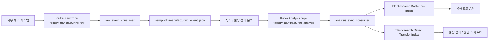
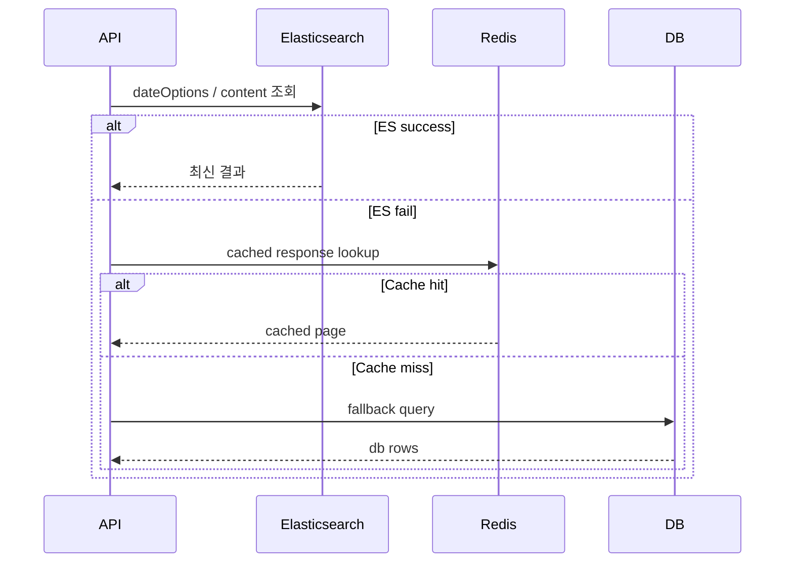
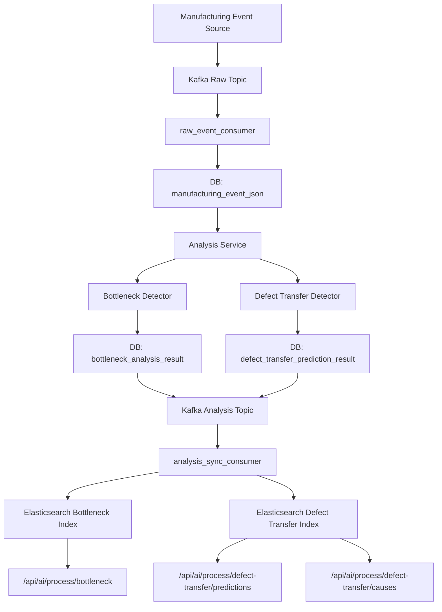
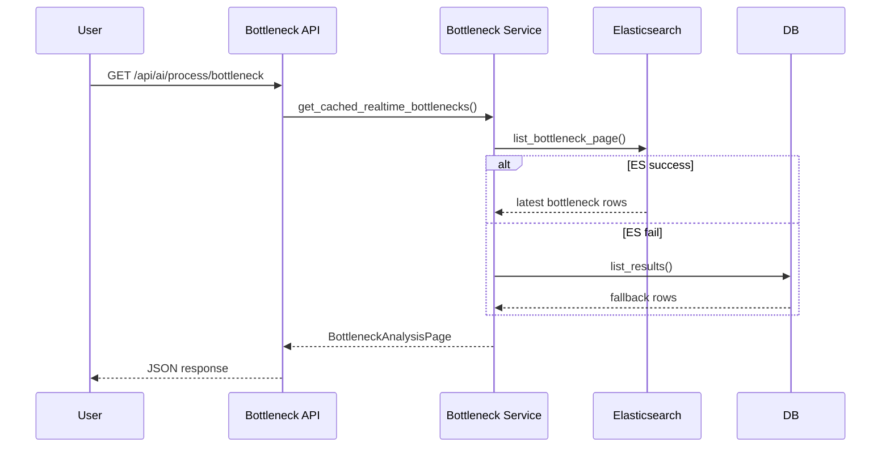
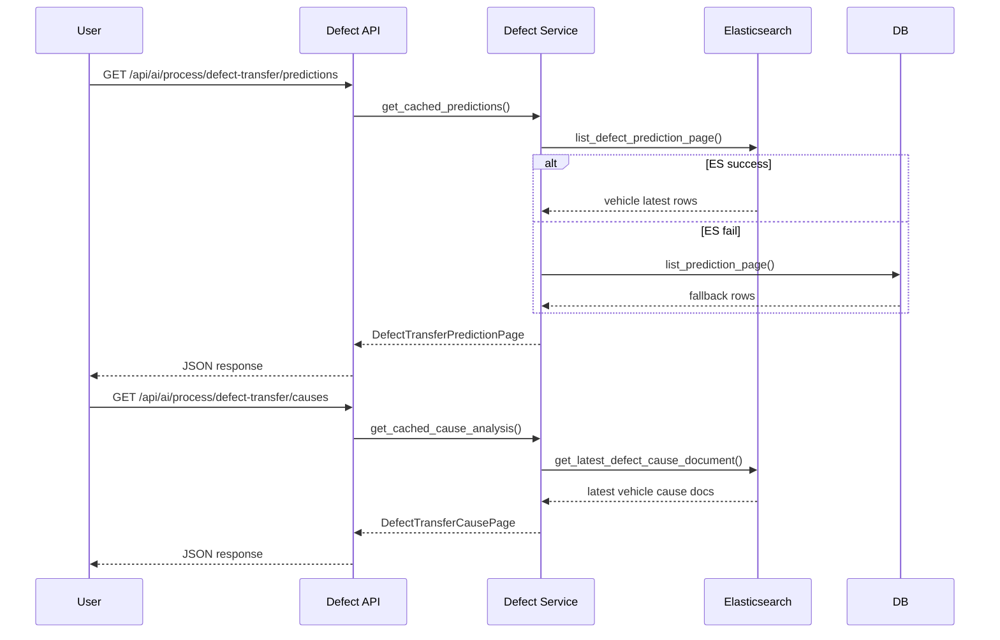
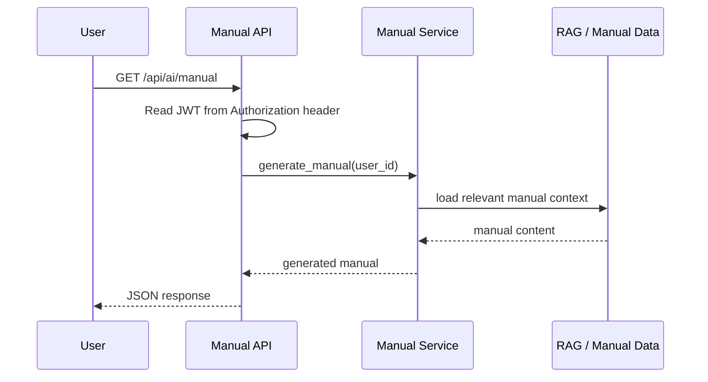

# AI Service

**서비스명: AIMS (Auto Intelligence Manufacturing System)**

AIMS는 자동차 스마트팩토리의 제조 데이터를 중심으로 병목 분석, 불량 전이 예측, SHAP 기반 원인 분석, AI 메뉴얼 생성을 제공하는
AI 기반 제조 관제 시스템입니다.

이 서비스는 단순히 결과를 조회하는 API가 아니라, 제조 이벤트를 수집하고 분석한 뒤
결과를 DB와 Elasticsearch에 함께 저장하고, 운영 중 데이터가 어긋나면 다시 맞추는 백엔드 역할까지 담당합니다.

핵심적으로 AIMS가 하는 일은 다음과 같습니다.

- 생산 공정에서 어느 구간이 병목인지 계산합니다.
- 어떤 차량이 다음 공정으로 불량이 전이될 가능성이 높은지 예측합니다.
- 예측 결과의 근거를 SHAP 기반으로 설명합니다.
- 사용자 요청에 따라 AI 메뉴얼을 생성합니다.
- Kafka로 들어오는 제조 이벤트를 받아 분석 파이프라인에 연결합니다.
- Elasticsearch를 조회용 검색 인덱스로 사용하고, 필요 시 다시 재색인합니다.

---

## 핵심 기능

### 1. 병목 분석

- `sampledb.manufacturing_event_json`의 제조 이벤트를 읽어 공정별 병목을 계산합니다.
- 결과는 공정 순위, 지연 시간, 영향 차량 수, 위험도 형태로 정리됩니다.
- 결과는 `bottleneck_analysis_result`에 저장됩니다.
- 조회 시에는 ES의 `detectedAt` 날짜를 기준으로 날짜 옵션을 만듭니다.
- Elasticsearch가 살아 있으면 ES 우선으로 조회하고, 실패하면 DB에서 동일한 결과를 다시 읽습니다.
- 같은 날짜 구간을 다시 계산하는 백필 / 재색인 기능도 함께 제공합니다.

#### 구현 로직

1. `BottleneckAnalysisService.get_realtime_bottlenecks()`가 먼저 날짜 옵션을 읽고, 요청 날짜가 없으면 최신 날짜를 선택합니다.
2. `ProcessAnalysisSearchRepository.list_bottleneck_date_options()`가 ES의 `detectedAt` 날짜를 집계해 날짜 옵션을 만듭니다.
3. `BottleneckAnalysisService`는 ES에서 `list_bottleneck_page()`를 먼저 호출해 최신 병목 row를 가져옵니다.
4. ES 조회가 실패하면 Redis 캐시를 확인하고, 캐시도 없으면 DB 조회로 fallback합니다.
5. 백필이나 재색인이 실행되면 해당 날짜의 기존 결과를 지우고 다시 계산해서 저장합니다.
6. 따라서 병목 화면은 최신 분석 결과를 기본으로 보여주되, 날짜 선택 시 과거 분석도 다시 볼 수 있습니다.

### 2. 불량 전이 예측

- 차량 단위로 불량이 다음 공정으로 전이될 가능성을 예측합니다.
- 현재 공정, 예측 공정, 전이 확률, 예상 발생 시점, 위험도를 함께 계산합니다.
- 결과는 `defect_transfer_prediction_result`에 저장됩니다.
- 조회 시에는 ES의 `predictedAt` 날짜를 기준으로 날짜 옵션을 만듭니다.
- 목록 조회는 차량별 최신 1건만 보여줘서, 차량의 현재 상태를 빠르게 확인할 수 있습니다.
- 같은 결과 테이블을 원인 분석에도 사용합니다.

#### 구현 로직

1. `DefectTransferAnalysisService.get_predictions()`가 날짜 옵션을 읽고, 요청 날짜가 없으면 최신 날짜를 선택합니다.
2. `ProcessAnalysisSearchRepository.list_defect_transfer_date_options()`가 ES의 `predictedAt` 날짜를 집계합니다.
3. ES가 가능하면 `list_defect_prediction_page()`에서 차량별 최신 1건을 가져옵니다.
4. ES가 실패하면 Redis 캐시를 먼저 보고, 없으면 DB의 `list_prediction_page()`로 fallback합니다.
5. 저장 단계에서는 각 제조 이벤트마다 모델 예측을 수행한 뒤 `replace_prediction_result()`로 결과를 저장합니다.
6. 저장할 때는 같은 `manufacturing_event_id`가 있으면 기존 row를 지우고 새 row를 넣어서 이벤트 기준 중복을 막습니다.
7. 재색인 시에는 해당 날짜의 문서를 ES에서 먼저 삭제한 뒤, 소스 이벤트를 다시 예측해서 넣습니다.

### 3. SHAP 기반 원인 분석

- 특정 차량의 최신 불량 전이 결과를 기준으로 원인을 설명합니다.
- 대표 원인 1개와 상세 원인 목록을 분리해 반환합니다.
- 각 원인은 영향도, 레이블, 설명 메시지를 함께 포함합니다.
- 불량 전이 예측과 같은 ES 날짜 옵션을 사용해 같은 시점의 데이터를 일관되게 조회합니다.

#### 구현 로직

1. `DefectTransferAnalysisService.get_cause_analysis()`가 차량 ID와 날짜 옵션을 기준으로 조회 대상을 결정합니다.
2. ES가 있으면 `get_latest_defect_cause_document()`가 차량별 최신 문서를 하나 가져옵니다.
3. 조회된 문서는 대표 원인과 상세 원인으로 분리됩니다.
4. 대표 원인은 화면의 summary 영역에 쓰고, 상세 원인은 리스트 형태로 보여줍니다.
5. 차량 ID가 없으면 최신 차량 기준으로 조회할 수 있습니다.

### 4. AI 메뉴얼

- JWT를 읽어서 로그인한 사용자 기준의 AI 메뉴얼을 생성합니다.
- `Authorization: Bearer ...` 헤더가 필요합니다.
- 메뉴얼 생성은 `app/ai_manual` 아래에서 별도로 관리합니다.
- 일반 분석 API와 분리된 독립 기능이라, 운영 정책이나 권한 조건을 따로 둘 수 있습니다.

#### 구현 로직

1. `ManualService.generate_manual(user_id)`가 요청의 시작점입니다.
2. 가장 위험도가 높은 알림 이벤트를 `AlertEventRepository`에서 먼저 가져옵니다.
3. 사용자 ID로 사용자 등급을 읽고, 없으면 `Junior`로 기본 처리합니다.
4. `CriticalEvent`, `OperatorInfo`, `FactoryContext`, `RagContext`를 묶어서 LLM 입력용 요청 객체를 만듭니다.
5. `VectorStore.search()`로 관련 문서를 검색해 RAG 컨텍스트를 구성합니다.
6. `manual_prompt`에 컨텍스트를 넣고 `ChatOpenAI`로 응답을 생성합니다.
7. 최종적으로 이벤트 정보와 생성된 메뉴얼을 함께 반환합니다.

### 5. 관리 기능

- 병목 백필 / 재색인
- 불량 전이 백필 / 재색인
- 날짜 단위 결과 삭제 후 재생성
- DB와 Elasticsearch 정합성 재구성

---

## Kafka / Elasticsearch 아키텍처 상세

### Kafka 기반 비동기 데이터 파이프라인

Kafka는 AIMS 아키텍처에서 제조 데이터의 실시간 수집 및 분석 파이프라인의 핵심 백본(Backbone) 역할을 수행합니다.

- **원천 데이터 수집 (Raw Topic)**:
  - `factory.manufacturing.raw` 토픽은 제조 현장(MES, PLC 등)으로부터 발생하는 모든 원천 제조 이벤트를 수집하는 진입점입니다.
  - 이벤트 스트림의 처리 순서 보장과 분산 처리를 위해 `vehicle_id` 또는 `equipment_id`를 파티션 키(Partition Key)로 활용할 수 있는 다중 파티션 구조를 가집니다.
  - `ai-analysis-consumer-group` 컨슈머 그룹에 속한 `app/kafka/raw_event_consumer.py`가 메시지를 소비하여 `sampledb.manufacturing_event_json`에 원천 데이터를 영구 저장합니다.

- **분석 결과 발행 및 동기화 (Analysis Topic)**:
  - 원천 이벤트를 기반으로 병목 분석 및 불량 전이 추론(AI 모델 수행)이 완료되면, 그 결과 데이터는 `factory.manufacturing.analysis` 토픽으로 발행(Publish)됩니다.
  - 발행된 분석 결과는 `ai-analysis-sync-consumer-group`에 속한 `analysis_sync_consumer`가 비동기적으로 소비하여 Elasticsearch에 동기화(Indexing)합니다.
  - 이를 통해 무거운 **AI 모델 추론**과 I/O 바운드 작업인 **검색엔진 색인**을 완전히 디커플링(Decoupling)하여, 시스템의 안정성과 확장성을 극대화합니다.

### Elasticsearch 기반 실시간 검색 및 집계

Elasticsearch는 대용량 AI 분석 결과를 지연 없이 빠르게 조회하고, 다차원 집계(Aggregation)를 수행하기 위한 메인 검색 및 분석 엔진입니다.

- **인덱스 설계 및 전략 (Index Strategy)**:
  - **병목 인덱스** (`settings.elasticsearch_bottleneck_index`, 기본값 `ai-bottleneck-result-v1` 계열): 공정별 지연 상태, 위험도 데이터를 저장합니다. `detectedAt` 필드를 기준으로 시계열로 관리됩니다.
  - **불량 전이 인덱스** (`settings.elasticsearch_defect_transfer_index`, 기본값 `ai-defect-transfer-result-v1` 계열): 차량별 불량 전이 확률, 발생 시점, SHAP 원인 분석 데이터를 저장합니다. `predictedAt` 필드를 기준으로 관리됩니다.
  - 시계열 데이터의 특성을 살려 인덱스 롤오버(Rollover) 및 ILM(Index Lifecycle Management) 정책을 적용하기 용이한 구조를 취합니다.

- **특화된 검색 및 집계 쿼리 활용 (Advanced Query)**:
  - **차량별 최신 상태 추출 (`collapse`)**: 동일 차량에 대해 공정 진행에 따라 여러 분석 결과가 누적될 수 있습니다. 응답 속도 최적화를 위해 ES의 `collapse` 파라미터를 사용하여 최신 타임스탬프(`predictedAt`) 기준 1건의 문서만 빠르게 추출합니다.
  - **날짜별 동적 옵션 생성 (`date_histogram`)**: 화면에서 제공되는 '분석 날짜 옵션'은 ES의 `date_histogram` 집계(Aggregation)를 활용해, 실제 분석 데이터가 존재하는 날짜 리스트만 빠르고 정확하게 동적 생성하여 제공합니다.

- **장애 대응 및 정합성 보장 (Fallback & Reindex)**:
  - **고가용성**: ES 클러스터에 일시적 장애가 발생해도 서비스는 중단되지 않습니다. 조회 API는 ES 실패를 감지하면 자동으로 Redis 캐시와 DB 폴백(Fallback) 조회를 수행합니다.
  - **데이터 재구성**: 백필(Backfill)이나 재색인(Reindex) 요청 시, 대상 날짜의 기존 ES 문서를 일괄 삭제(Delete By Query)하고 소스 이벤트로부터 다시 계산/색인하여 DB와 ES 간의 데이터 정합성을 일관되게 맞춥니다.

### Kafka -> ES 색인 흐름

1. raw topic의 제조 이벤트가 `raw_event_consumer`로 들어옵니다.
2. 원천 이벤트가 `manufacturing_event_json`에 저장됩니다.
3. 병목 / 불량 전이 분석이 수행됩니다.
4. 분석 결과가 `factory.manufacturing.analysis` topic으로 발행됩니다.
5. `analysis_sync_consumer`가 해당 메시지를 읽습니다.
6. `ProcessAnalysisSearchRepository`가 병목 / 불량 전이 결과를 Elasticsearch에 색인합니다.
7. 조회 API는 ES를 먼저 보고, ES가 없을 때만 DB / Redis를 사용합니다.

### 주요 Kafka / ES 엔터티

| 구분 | 이름 | 역할 |
| --- | --- | --- |
| Raw Topic | `factory.manufacturing.raw` | 제조 원천 이벤트 입력 |
| Analysis Topic | `factory.manufacturing.analysis` | 분석 결과 발행 및 ES 동기화 입력 |
| Raw Consumer Group | `ai-analysis-consumer-group` | 원천 이벤트 소비 |
| Sync Consumer Group | `ai-analysis-sync-consumer-group` | 분석 결과 ES 동기화 |
| Bottleneck Index | `settings.elasticsearch_bottleneck_index` | 병목 결과 검색 |
| Defect Transfer Index | `settings.elasticsearch_defect_transfer_index` | 불량 전이 / 원인 검색 |

---

## API 요약

### 분석 조회

- `GET /api/ai/process/bottleneck`
- `GET /api/ai/process/defect-transfer/predictions`
- `GET /api/ai/process/defect-transfer/causes`

### 관리 API

- `POST /api/ai/admin/analysis/backfill/bottleneck`
- `POST /api/ai/admin/analysis/backfill/defect-transfer`
- `POST /api/ai/admin/analysis/reindex/bottleneck`
- `POST /api/ai/admin/analysis/reindex/defect-transfer`

### AI 메뉴얼

- `GET /api/ai/manual`

---

## 데이터 흐름

### Kafka 수집

1. 외부 시스템이 제조 원천 이벤트를 Kafka raw topic으로 보냅니다.
2. `raw_event_consumer`가 메시지를 읽습니다.
3. 원천 이벤트를 `manufacturing_event_json`에 저장합니다.
4. 필요 시 병목 / 불량 전이 분석 이벤트를 `factory.manufacturing.analysis` topic으로 발행합니다.
5. `analysis_sync_consumer`가 분석 결과를 읽고 Elasticsearch에 색인합니다.

### 병목

1. `sampledb.manufacturing_event_json`에서 이벤트를 읽습니다.
2. 병목 모델이 공정별 병목을 계산합니다.
3. `bottleneck_analysis_result`에 저장합니다.
4. Elasticsearch에 재색인합니다.
5. 조회 API는 ES 우선으로 응답합니다.

### 불량 전이 / 원인

1. `sampledb.manufacturing_event_json`에서 SENT 이벤트를 읽습니다.
2. 불량 전이 모델이 예측을 수행합니다.
3. `defect_transfer_prediction_result`에 저장합니다.
4. Elasticsearch에 재색인합니다.
5. 조회 API는 차량별 최신 1건을 반환합니다.
6. 원인 분석은 최신 불량 전이 결과의 SHAP 원인을 보여줍니다.

### AI 메뉴얼

1. 요청 헤더에서 JWT를 읽습니다.
2. 사용자 ID를 추출합니다.
3. 메뉴얼 서비스를 호출해 응답을 만듭니다.

### Kafka / ES 전체 흐름



### ES 조회 우선순위



---

## 프로젝트 구조

```text
app/
├─ api/                     # FastAPI 라우터
│  ├─ router.py             # API 라우터 통합
│  └─ routers/              # 기능별 엔드포인트
│     ├─ process.py         # 병목 조회
│     ├─ defect_transfer.py # 불량 전이 / 원인 조회
│     ├─ analysis_maintenance.py # 병목 / 불량 전이 백필, 재색인
│     ├─ manual.py          # AI 메뉴얼
│     ├─ manufacturing_event.py  # 제조 이벤트 생성/조회
│     └─ health.py          # 헬스 체크
├─ service/
│  ├─ analysis/              # 병목, 불량 전이, 재색인, 조회 로직
│  ├─ manufacturing/         # 제조 이벤트 생성 및 처리
│  └─ llm/                   # LLM 연동 계층
├─ repository/               # DB 읽기 / 쓰기
│  ├─ bottleneck_analysis_repository.py
│  ├─ defect_transfer_prediction_repository.py
│  ├─ manufacturing_event_repository.py
│  ├─ manufacturing_event_template_repository.py
│  ├─ equipment_repository.py
│  └─ sampledb_schema.py
├─ search/                   # Elasticsearch 저장 / 조회
├─ ml/                       # 모델 추론, 학습 산출물, feature 처리
│  ├─ inference/             # 추론기
│  ├─ training/              # 학습 산출물 / 실험 노트북
│  ├─ features/              # feature 생성
│  └─ artifacts/             # 배포용 모델 파일
├─ ai_manual/                # AI 메뉴얼 생성
│  ├─ repository/            # 알림 이벤트, 사용자 정보 조회
│  ├─ rag/                   # 벡터 검색
│  ├─ prompt/                # 프롬프트 템플릿
│  └─ schema/                # 메뉴얼 요청 / 응답 모델
├─ kafka/                    # 제조 이벤트 수집 / 발행
├─ dto/                      # 요청 / 응답 모델
├─ utils/                    # 공통 유틸
├─ scheduler/                # 주기 실행 품질/제조 작업
└─ batch/                    # 백필 / 배치 작업
```

### 역할 요약

- `app/api`: 외부 요청을 받는 진입점
- `app/service/analysis`: 병목, 불량 전이, 재색인, 조회 로직
- `app/repository`: DB 읽기 / 쓰기
- `app/search`: Elasticsearch 저장 / 조회
- `app/ai_manual`: AI 메뉴얼 생성
- `app/ml`: 모델 추론과 산출물 관리
- `app/kafka`: 제조 이벤트 수집과 후속 처리
- `app/scheduler`: 주기적으로 실행되는 품질/제조 작업
- `app/batch`: 수동 실행용 백필 / 배치 작업

---

## 시스템 다이어그램

### 전체 분석 흐름



### 병목 조회 흐름



### 불량 전이 / 원인 흐름



### AI 메뉴얼 흐름



---

## 실행

```powershell
python -m venv venv
.\venv\Scripts\Activate.ps1
pip install -r requirements.txt
uvicorn app.main:app --reload
```

주요 주소:

- API Root: `http://127.0.0.1:8000/`
- Health: `http://127.0.0.1:8000/api/health`
- Swagger: `http://127.0.0.1:8000/docs`

---

## 참고 포인트

- 병목의 날짜 기준 필드는 `detected_at`입니다.
- 불량 전이와 SHAP의 날짜 기준 필드는 `predicted_at`입니다.
- 병목은 공정 단위, 불량 전이는 차량 단위로 조회합니다.
- `dateOptions`는 ES 기준으로 만들고, ES 실패 시 DB로 내려갑니다.
- 병목 / 불량 전이 / SHAP / 메뉴얼은 서로 다른 책임을 가지지만, 모두 제조 이벤트를 중심으로 연결됩니다.
- DB는 정본 데이터, Elasticsearch는 빠른 조회용 검색 인덱스로 이해하면 전체 구조를 잡기 쉽습니다.
